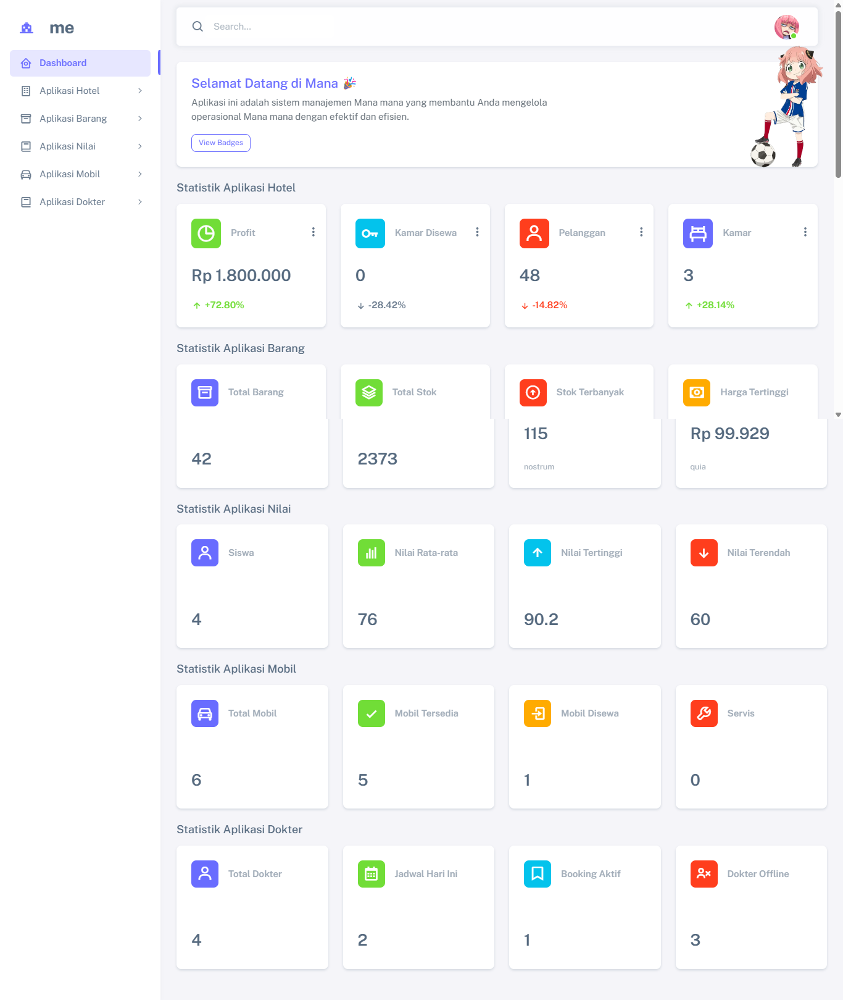

# Aplikasi Manajemen Hotel, Barang, Nilai, Mobil, dan Dokter



Aplikasi ini adalah sistem manajemen berbasis Laravel yang membantu mengelola data hotel, barang, nilai mahasiswa, mobil, dan dokter. Terdapat dashboard statistik dinamis untuk setiap modul.

## Fitur Utama
- **Manajemen Hotel:** Data pelanggan, kamar, transaksi sewa, dan pendapatan.
- **Manajemen Barang:** CRUD barang, stok, harga, statistik barang.
- **Manajemen Nilai:** Data mahasiswa, nilai rata-rata, statistik nilai.
- **Manajemen Mobil:** Data mobil, status sewa, statistik mobil.
- **Manajemen Dokter:** Data dokter, jadwal praktik, booking, statistik dokter.
- **Dashboard Statistik:** Statistik real-time untuk semua modul (total, rata-rata, tertinggi, dsb).
- **Konfirmasi Hapus Modern:** Modal Bootstrap untuk konfirmasi hapus data.

## Teknologi
- Laravel 9+
- Bootstrap 5
- jQuery
- Boxicons
- MySQL/MariaDB

## Cara Menjalankan
1. Clone repository ini
2. Jalankan `composer install`
3. Copy `.env.example` ke `.env` dan atur koneksi database
4. Jalankan `php artisan key:generate`
5. Jalankan migrasi: `php artisan migrate`
6. (Opsional) Seed data awal: `php artisan db:seed`
7. Jalankan server: `php artisan serve`
8. Akses aplikasi di `http://localhost:8000`

## Struktur Database
- Tabel: `barangs`, `nilais`, `mobils`, `dokters`, `bookings`, `hotels`, `pelanggans`, `rooms`, `rentals`, `transaksis`

## Catatan
- Setiap modul memiliki halaman index, create, edit, show, dan statistik.
- Statistik dashboard otomatis update sesuai data di database.
- Konfirmasi hapus menggunakan modal modern, bukan alert browser.

## Dokumentasi

### 1. Struktur Folder
```
app/Http/Controllers   # Semua controller aplikasi
app/Models             # Semua model Eloquent
resources/views        # Semua file blade (tampilan)
routes/web.php         # Routing aplikasi web
database/migrations    # File migrasi database
public/                # Asset publik (css, js, gambar)
```

### 2. Penjelasan Fitur
- **Manajemen Hotel:** CRUD data hotel, pelanggan, kamar, transaksi, statistik.
- **Manajemen Barang:** CRUD barang, stok, harga, statistik.
- **Manajemen Nilai:** CRUD nilai mahasiswa, statistik nilai.
- **Manajemen Mobil:** CRUD mobil, status sewa, statistik.
- **Manajemen Dokter:** CRUD dokter, jadwal, booking, statistik.

### 3. Statistik Dashboard
- Semua statistik diambil otomatis dari database.
- Setiap modul memiliki 4 statistik utama (total, rata-rata, tertinggi, dsb).

### 4. Konfirmasi Hapus Modern
- Setiap hapus data menggunakan modal Bootstrap, bukan alert browser.

### 5. Cara Menambah Fitur Baru
1. Buat migration dan model baru.
2. Buat controller dan route.
3. Buat tampilan di resources/views.
4. Tambahkan statistik di controller dan tampilkan di dashboard.

---

Aplikasi ini cocok untuk pembelajaran Laravel dan pengelolaan data multi-modul.